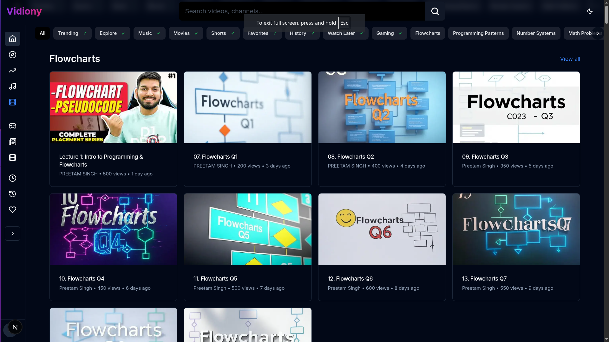
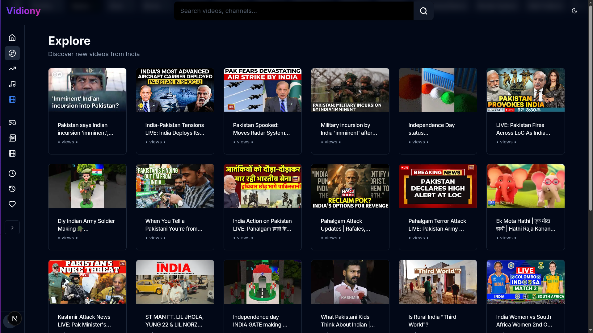
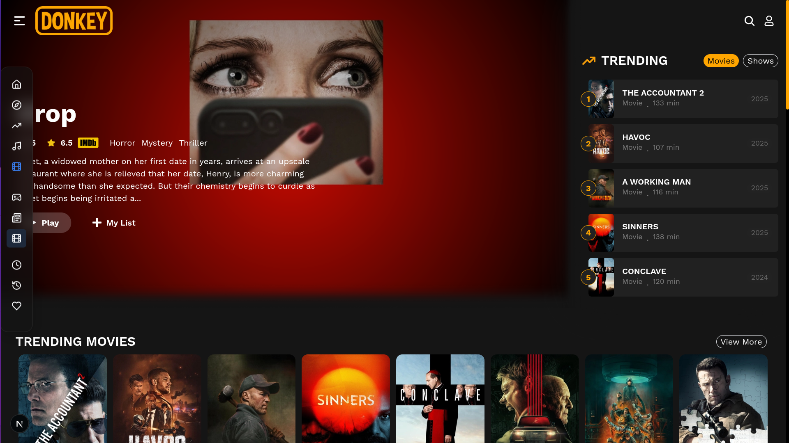
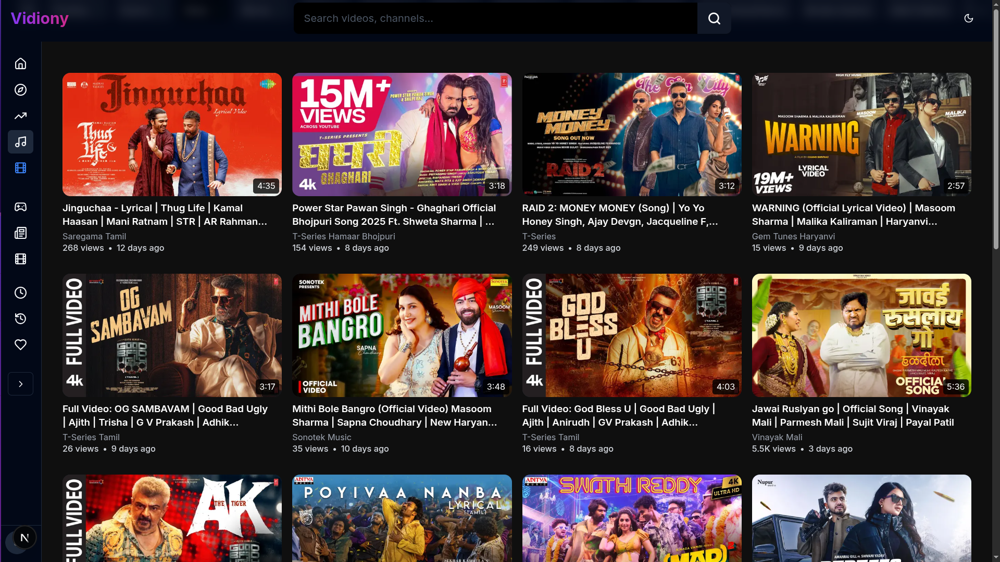
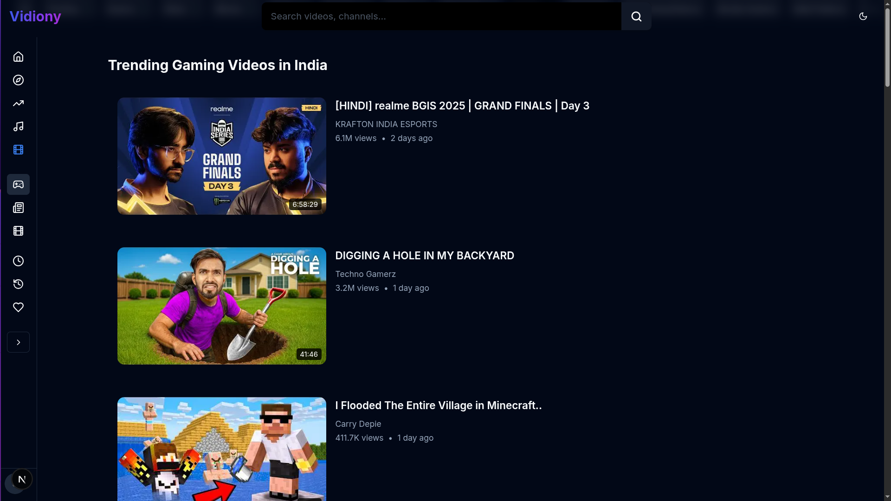
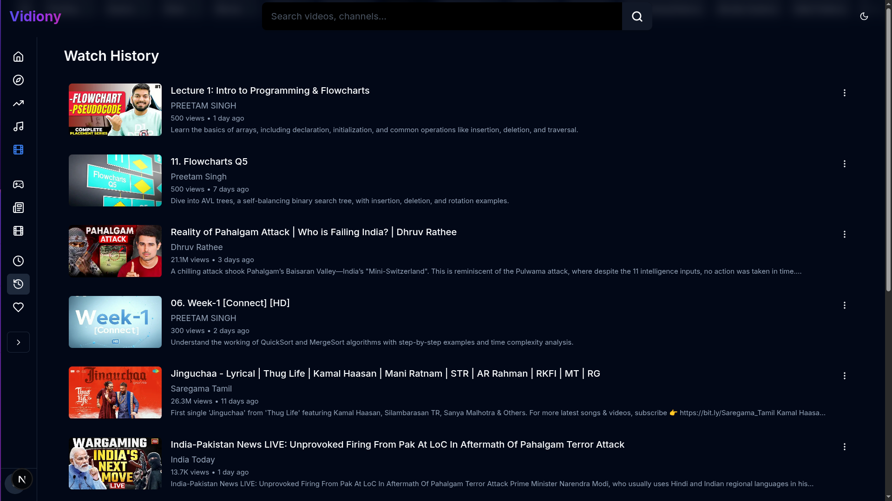

# Vidion

A modern video streaming platform built with Next.js, offering a rich set of features for video content consumption and management.

🌐 **Live Website**: [https://vidion.vercel.app/](https://vidion.vercel.app/)


## Description

Vidion is a comprehensive educational video streaming platform that provides users with a seamless experience for watching programming tutorials, algorithm explanations, and technical content. The platform includes extensive coverage of programming concepts, data structures, algorithms, and computer science fundamentals.

## Features

- 🎬 Video streaming with support for multiple content types
- 🔍 Advanced search functionality
- 📱 Responsive design for all devices
- 🎨 Modern UI with dark/light theme support
- 📊 User dashboard with viewing history
- ⭐ Favorites and watch later functionality
- 🎯 Comprehensive programming tutorials
- 🔄 Offline mode support
- 📈 Trending content section
- 🏷️ Category-based content organization

## Content Categories

- 💻 Programming Basics
- 📊 Flowcharts & Algorithms
- 🔢 Number Systems
- 📝 Programming Patterns
- 🧮 Math Problems
- 🔍 Complexity Analysis
- 📚 Data Structures
  - Arrays
  - Linked Lists
  - Stacks
  - Queues
  - Trees
- 🎯 Algorithm Topics
  - Sorting Algorithms
  - Searching Algorithms
  - String Algorithms
  - Matrix Algorithms
- 🔧 Advanced Topics
  - Bit Manipulation
  - Pointers
  - Recursion
  - C++ Concepts

## Preview

Here are some screenshots showcasing the main features of Vidion:

### Home Page

*The main landing page with featured content and navigation*

### Explore Section

*Discover new content and trending videos*

### Movies Section

*Browse and watch movies with detailed information*

### Music Section

*Enjoy music videos and playlists*

### Gaming Content

*Dedicated section for gaming-related content*

### History & Trending

*Track your viewing history and discover trending content*

### TMDB Movies Integration

*Seamless integration with TMDB for movie information*

## Tech Stack

### Frontend
- Next.js 15.3.1
- React 19.1.0
- TypeScript
- Tailwind CSS
- Radix UI Components
- Framer Motion
- Zustand (State Management)
- React Hook Form
- Zod (Validation)

### Backend
- Next.js API Routes
- Google APIs Integration

### Development Tools
- TypeScript
- PostCSS
- Sharp (Image Optimization)
- Vercel Analytics & Speed Insights

## Project Structure

```
├── app/                    # Main application directory
│   ├── api/               # API routes
│   ├── auth/              # Authentication pages
│   ├── components/        # Reusable components
│   ├── contexts/          # React contexts
│   ├── hooks/             # Custom React hooks
│   ├── lib/               # Utility functions
│   ├── movies/            # Movie-related pages
│   ├── shorts/            # Shorts content pages
│   └── ...                # Other feature directories
├── components/            # Shared components
├── public/                # Static assets
├── styles/                # Global styles
└── types/                 # TypeScript type definitions
```

## Installation

1. Clone the repository:
```bash
git clone https://github.com/Preetam8873/vidio-v1.0.git
cd vidion
```

2. Install dependencies:
```bash
pnpm install
```

3. Set up environment variables:
Create a `.env.local` file with the following variables:
```
NEXT_PUBLIC_CLERK_PUBLISHABLE_KEY=your_clerk_key
CLERK_SECRET_KEY=your_clerk_secret
```

4. Run the development server:
```bash
pnpm dev
```

## Usage

1. Start the development server using `pnpm dev`
2. Open [http://localhost:3000](http://localhost:3000) in your browser
3. Sign in using the authentication system
4. Browse and watch educational programming content

## Environment Variables

Required environment variables:
- `NEXT_PUBLIC_CLERK_PUBLISHABLE_KEY`: Clerk authentication public key
- `CLERK_SECRET_KEY`: Clerk authentication secret key

## Development

- `pnpm dev`: Start development server
- `pnpm build`: Build for production
- `pnpm start`: Start production server
- `pnpm lint`: Run linting

## License

This project is private and proprietary.

## Performance Optimizations

The project includes several performance optimizations:
- Static page generation
- Image optimization
- HTTP/2 Push
- Granular code splitting
- Font optimization
- Modern JavaScript features
- Tree shaking
- Module concatenation 
